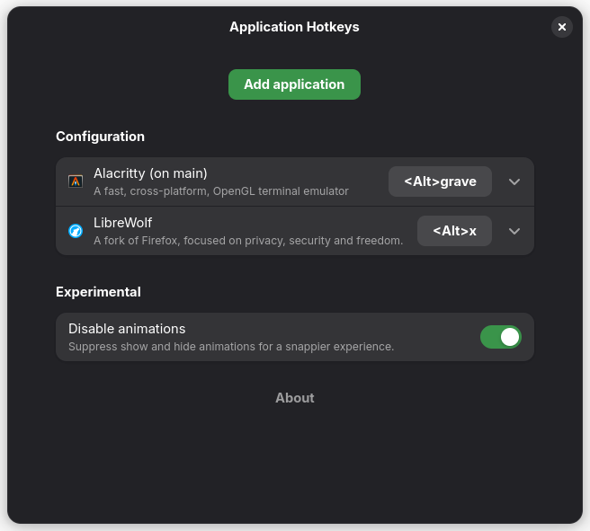

# Application Hotkeys

A GNOME Shell Extension that lets you launch, show, and hide applications using
hotkeys.

- **Launch** an application if it's not running
- **Show** an application if it's running, but not focused
- **Hide** an application if it's already focused



> [!NOTE]
>
> - Applications are always moved to the active workspace
> - Applications are always moved to the monitor where your pointer is
> - If an application has multiple windows open, they are cycled
> - Showing and hiding applications happens instantly (optional)

## Installation

There are multiple ways to install:

[](https://extensions.gnome.org/extension/8641/application-hotkeys/)

1. Using
   [Extension Manager](https://flathub.org/en/apps/com.mattjakeman.ExtensionManager)
   (search for "Application Hotkeys")
2. Through the
   [GNOME Extensions website](https://extensions.gnome.org/extension/8641/application-hotkeys/)
3. [Each GitHub release](https://github.com/aaimio/application-hotkeys/releases)
   provides the extension as a `.zip`, download it and:

```sh
gnome-extensions install application-hotkeys@aaimio.github.com.shell-extension.zip
```

## Contributing

### Development

The easiest way to get started is by using the devcontainer
([docs](https://code.visualstudio.com/docs/devcontainers/containers#_quick-start-open-a-git-repository-or-github-pr-in-an-isolated-container-volume)):

1. [Open the devcontainer](https://vscode.dev/redirect?url=vscode://ms-vscode-remote.remote-containers/cloneInVolume?url=https://github.com/aaimio/application-hotkeys)
   ([source](../.devcontainer/devcontainer.json))
2. Once you made changes, pack the extension:
   - `make pack` (see [Makefile](../Makefile))
3. Copy the generated `.zip` file to the host and install it locally:
   - `gnome-extensions install application-hotkeys@aaimio.github.com.shell-extension.zip`
4. Start a nested GNOME Shell (on the host) for testing:
   - `dbus-run-session -- gnome-shell --nested --wayland` (≤48)
   - `dbus-run-session -- gnome-shell --devkit` (≥49)

<details>
  <summary>For a local approach:</summary>

1. `git clone git@github.com:aaimio/application-hotkeys.git`
2. `pnpm install` ([install pnpm](https://pnpm.io/installation))
3. Once you made changes, install the extension locally:
   - `make install` (see [Makefile](../Makefile))
4. Start a nested GNOME Shell for testing:
   - `dbus-run-session -- gnome-shell --nested --wayland` (≤48)
   - `dbus-run-session -- gnome-shell --devkit` (≥49)

</details>

### Translations

Translations are done through
[Weblate](https://hosted.weblate.org/projects/application-hotkeys/), feel free
to contribute!

[](https://hosted.weblate.org/engage/application-hotkeys/)
